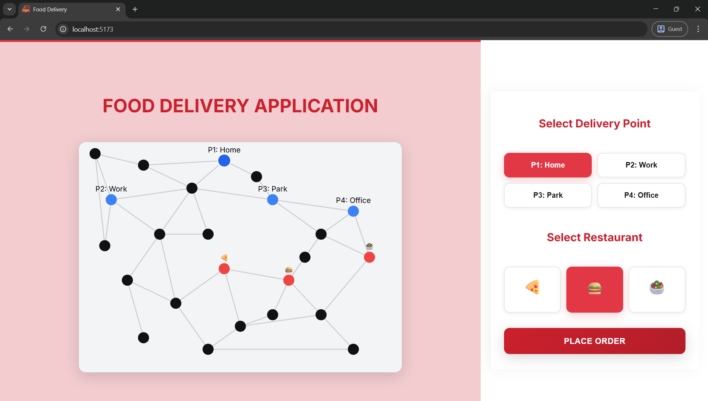
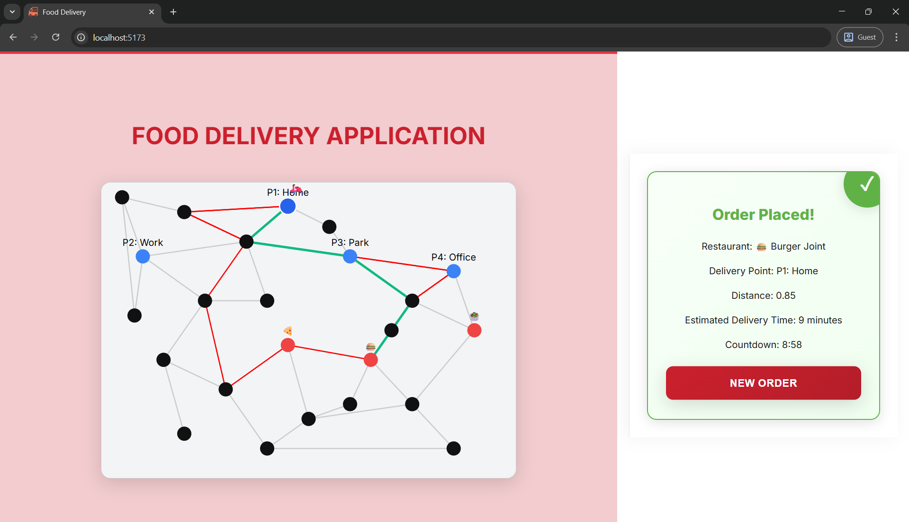

# 🍕 Food Delivery Route Optimization Using Dijkstra’s Algorithm

## 📖 Overview

This project demonstrates a simple food delivery **route optimization system** using graph theory. By modeling delivery routes as a weighted graph, the system finds the **shortest and most efficient path** from restaurants to users using **Dijkstra’s algorithm**. It visually simulates deliveries on an interactive map interface built with React.




---

## ⚙️ Features

* **Interactive map visualization**
* Multiple user and restaurant nodes
* Automatic **shortest path computation**
* Delivery scooter animation from restaurant → user
* Simple and clean UI

---

## 🧮 Optimization Technique

The core of the project is **Dijkstra’s Algorithm**, a classic graph-based optimization method for shortest path problems. It minimizes total travel **distance and time**, ensuring optimal delivery routing.

---

## 🧠 Tech Stack

| Category | Technology | Purpose |
| :--- | :--- | :--- |
| **Frontend** | React.js | User Interface |
| **Algorithm** | Dijkstra’s Algorithm | Graph Optimization |
| **Language** | JavaScript | Core logic |
| **Visualization** | SVG-based Map | Interactive map rendering |

---

## 🚀 How to Run

Follow these steps to set up and run the application locally:

```bash
# Clone the repository
git clone [https://github.com/yourusername/food-delivery-optimization.git](https://github.com/yourusername/food-delivery-optimization.git)

# Navigate to the project folder
cd food-delivery-optimization

# Install dependencies
npm install

# Run the app
npm start
